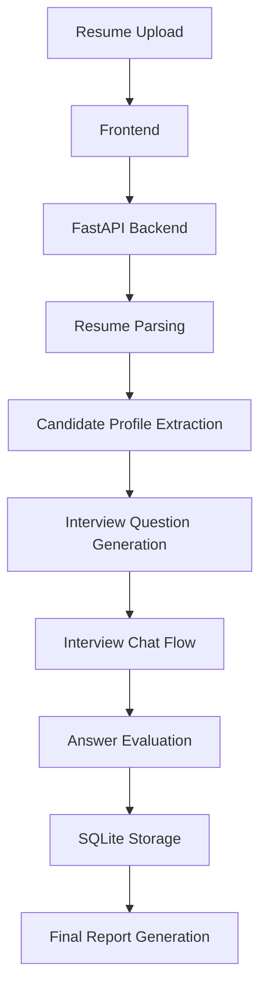

# AI Interview Agent - Design Document

## 1. Overview

The **AI Interview Agent** is an MVP application for conducting structured, resume-aware technical interviews.  
It accepts a candidate resume, extracts relevant information, generates interview questions, runs a chat-based interview, evaluates responses, and produces a final report for review.

The goal is to deliver a clean, working system that demonstrates the core interview workflow end to end.

---

## 2. Objective

This system is designed to:

- automate initial technical screening
- generate personalized interview questions from a resume
- evaluate candidate responses consistently
- produce a clear report for recruiters or hiring managers

---

## 3. Confirmed Features

The following features will be part of the MVP:

- **Resume upload**
    
    - Support for PDF resumes
    - Optional support for DOCX and TXT
- **Resume data extraction**
    
    - Candidate name
    - Email if available
    - Skills
    - Projects
    - Experience
    - Education
    - Technologies mentioned
- **Candidate profile generation**
    
    - Convert resume text into a structured candidate profile using AI
- **Interview plan generation**
    
    - Identify skill areas
    - Configure voice mode for the candidate session
    - Generate question flow
- **Chat-based interview**
    
    - One question at a time
    - Candidate answers through text or browser dictation
    - Interviewer prompts can be spoken aloud by the browser
    - Interview progresses step by step
- **Follow-up question logic**
    
    - Ask follow-up questions for short, partial, or unclear answers
    - Probe deeper into claimed skills or projects
- **Answer evaluation**
    
    - Score each answer on a (1) to (5) scale
    - Store short feedback for each response
- **Final report generation**
    
    - Overall score
    - Skill-wise scores
    - Strengths
    - Weaknesses
    - Final recommendation
    - Interview transcript summary
- **Basic persistence**
    
    - Store candidate, interview, answer, and report data in SQLite

---

## 4. Future Enhancements

The platform can later be extended with:

- video interviews
- AI avatar interviewer
- recruiter dashboard
- candidate comparison analytics
- authentication and role-based access
- proctoring and anti-cheating checks
- PostgreSQL or cloud database migration
- multi-round interview workflows
- role-specific evaluation rubrics

---

## 5. Tech Stack

## Frontend

- React
- Vite
- TypeScript
- Tailwind CSS
- Axios
- React Router

## Backend

- Python
- FastAPI

## AI Layer

- OpenAI API or Azure OpenAI
- Optional mock mode for demo fallback
- Current implementation uses a provider-neutral LLM client with OpenAI, Azure OpenAI, legacy Claude-compatible, and mock/fallback modes.

## Resume Parsing

- PyPDF2 or pdfplumber for PDF
- python-docx for DOCX

## Database

- SQLite

---

## 6. High-Level Architecture



---

## 7. Core Workflow

### Resume Processing

The user uploads a resume and enters basic candidate details.  
The backend extracts text and generates a structured candidate profile.

### Interview Preparation

The system uses the candidate profile to generate interview topics and personalized questions.

### Interview Execution

The candidate completes a text or voice-assisted interview.  
The system asks one question at a time and evaluates each response in the backend.

### Report Generation

At the end of the interview, the system creates a final report with scoring, observations, and a hiring recommendation.

---

## 8. Main Screens

## Home Page

- Project title
- Upload Resume
- Start Interview
- View Reports

## Resume Upload Page

- Candidate name
- Role applied for
- Resume upload
- Voice interview option
- Start Interview button

## Interview Page

- Candidate details and skills
- Chat window
- Answer input, dictation control, and submit action

## Report Page

- Candidate details
- Overall score
- Skill-wise scores
- Strengths
- Weaknesses
- Recommendation
- Q&A summary

---

## 9. Backend Components

## Resume Parser

Responsible for extracting raw text from uploaded files.

## AI Profile Extractor

Converts resume text into a structured candidate profile.

## Interview Generator

Creates interview sections and question sets based on role, skills, projects, and experience.

## Evaluation Engine

Scores each answer, generates feedback, and determines whether a follow-up is required.

## Report Generator

Builds the final interview summary and recommendation.

---

## 10. Data Model

## candidates

```sql
id INTEGER PRIMARY KEY
name TEXT
email TEXT
role_applied TEXT
resume_text TEXT
skills TEXT
created_at DATETIME
```

## interviews

```sql
id INTEGER PRIMARY KEY
candidate_id INTEGER
status TEXT
overall_score REAL
recommendation TEXT
created_at DATETIME
```

## interview_answers

```sql
id INTEGER PRIMARY KEY
interview_id INTEGER
question TEXT
answer TEXT
score INTEGER
feedback TEXT
skill_area TEXT
created_at DATETIME
```

## reports

```sql
id INTEGER PRIMARY KEY
interview_id INTEGER
report_text TEXT
created_at DATETIME
```

---

## 11. API Endpoints

## POST `/api/resume/upload`

Uploads a resume, extracts text, and returns parsed candidate details.

## POST `/api/interview/plan`

Generates interview sections and questions.

## POST `/api/interview/start`

Creates a new interview session and returns the first question.

## POST `/api/interview/answer`

Submits an answer, evaluates it, and returns either a follow-up or the next question.

## POST `/api/interview/end`

Ends the session and generates the final report.

## GET `/api/reports/{id}`

Returns the saved report for display.

---

## 12. Evaluation Model

Each answer is evaluated on:

- technical correctness
- clarity
- depth of explanation
- practical understanding
- confidence

### Score Scale

- **5** = Excellent
- **4** = Good
- **3** = Acceptable
- **2** = Weak
- **1** = Incorrect or insufficient

### Recommendation Logic

- **4.0 and above** = Strong Hire
- **3.2 to 3.9** = Hire / Proceed
- **2.5 to 3.1** = Hold
- **Below 2.5** = No Hire

---

## 13. Design Considerations

- keep the interface simple and demo-friendly
- use structured AI outputs where possible
- separate frontend, backend, and AI logic cleanly
- store data in a format that supports future expansion
- include fallback behavior if AI responses fail or are malformed

---

## 14. Conclusion

The **AI Interview Agent** MVP is designed as a practical, professional proof of concept for automating early technical interviews.  
It focuses on resume-driven question generation, chat-based interaction, response evaluation, and structured reporting, while keeping the architecture simple enough for fast development and future extension.

---
